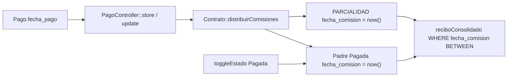

# Informe técnico: desfase de fechas y reporte de comisiones

**Módulo:** Comisiones / recibo consolidado por asesor  
**Timezone de la aplicación:** `America/Mexico_City` (`config/app.php`)  
**Ventana de corte operativa:** miércoles a martes  
**Alcance de este documento:** causa raíz, impacto en datos, corrección retroactiva y plan de fix en código.  
**Estado:** el plan de solución de la sección 3 ya está implementado en código (parcialidades con `fecha_pago`, recibo sin doble conteo, comando `comisiones:corregir-fechas`). Falta ejecutar el comando en producción (`--dry-run` y luego `--execute`) con backup.

---

## 1. Análisis de causa raíz

Hay **un error de fecha** y **un error de consulta/agregación**. El segundo se agrava porque el primero reescribe fechas de comisiones padre.



### 1.1 Desfase entre fecha de abono y fecha de comisión

**Síntoma:** en el historial del contrato (p. ej. #680) un abono en efectivo aparece el 27 de julio de 2026; en el recibo del asesor la comisión aparece el 29 de julio. Ese salto cruza el corte semanal (el 27 es lunes; el 29 es miércoles) y retrasa el pago al asesor.

**Qué fecha usa cada pantalla**

| Superficie | Columna | Origen |
|---|---|---|
| Historial / ticket de pago | `pagos.fecha_pago` | Formulario (`Y-m-d\TH:i`, obligatorio) |
| Tabla de comisiones del contrato, recibo, filtro del recibo | `comisiones.fecha_comision` | `now()` al generar parcialidad o al marcar Pagada |

No existe `pago_id` (ni equivalente) en `comisiones`. No hay vínculo explícito abono → comisión.

**Flujo exacto al registrar un abono**

1. [`PagoController::store`](app/Http/Controllers/PagoController.php) / `update` persiste el pago con `fecha_pago` y, si `estado === 'hecho'`, llama:

```php
$pago->contrato->distribuirComisiones(); // no pasa fecha_pago
```

2. [`Contrato::distribuirComisiones`](app/Models/Contrato.php) calcula saldo de cuotas (excluye `inicial` y `bonificación`) y crea filas `PARCIALIDAD` **Pagada** con:

```php
'fecha_comision' => now(),
```

Si el padre queda cubierto:

```php
$comision->update([
    'estado' => 'Pagada',
    'fecha_comision' => now(), // pisa la fecha original (fecha_inicio del contrato)
]);
```

3. [`ComisioneController::toggleEstado`](app/Http/Controllers/ComisioneController.php) vuelve a asignar `fecha_comision = now()` al pasar a Pagada, y `fecha_comision = created_at` al volver a Pendiente (tampoco usa `fecha_pago`).

**Filtro del recibo** — [`ComisioneController::reciboConsolidado`](app/Http/Controllers/ComisioneController.php):

```php
$fechaInicio = \Carbon\Carbon::parse($request->fecha_inicio)->startOfDay();
$fechaFin    = \Carbon\Carbon::parse($request->fecha_fin)->endOfDay();

$comisionesQuery = Comisione::where('empleado_id', $empleado->id)
    ->whereBetween('fecha_comision', [$fechaInicio, $fechaFin]);
```

La vista [`recibo_consolidado.blade.php`](resources/views/comisione/recibo_consolidado.blade.php) imprime `fecha_comision`.

**Conclusión:** si el cobro se **captura** el miércoles 29 con `fecha_pago` del lunes 27, la comisión entra en la ventana que **abre** el 29, no en la que **cierra** el martes 28. El desfase de dos días encaja con captura posterior (`now()`), no con UTC vs CDMX (eso, en el peor caso nocturno, movería un día).

`startOfDay` / `endOfDay` está correcto. El defecto no es el truncado 00:00–23:59, sino **filtrar e imprimir la columna equivocada** (instante de sistema vs fecha de negocio del abono).

Esquema: [`database/migrations/2025_07_11_190225_create_comisiones_table.php`](database/migrations/2025_07_11_190225_create_comisiones_table.php) define `fecha_comision` datetime con default `CURRENT_TIMESTAMP` (“fecha en que se generó”), coherente con el bug de producto.

### 1.2 Filtro de rango “sin comisiones” (contrato #682, abono 30-jul)

Misma causa. El rango 22-jul a 4-ago busca `fecha_comision`, no `pagos.fecha_pago`.

Si la PARCIALIDAD se creó al capturar el pago **después** del 4 de agosto, o si el usuario mira la fila padre (cuya `fecha_comision` sigue siendo `contratos.fecha_inicio` hasta liquidar), el recibo responde que no hay comisiones para ese abono.

**Excepción de negocio (no es timezone):** `getSaldoDisponibleParaComisionesTradicionalesAttribute` **no** usa pagos `inicial` ni `bonificación`. Esos abonos no generan PARCIALIDAD. Un “abono” de esos tipos no aparecerá nunca en el recibo semanal de comisiones tradicionales.

### 1.3 “Todas las comisiones” y contratos ya liquidados (duplicación)

El select “Todas las comisiones” envía `tipo_comision` vacío. Entonces **no** hay filtro de tipo: entran padres y parcialidades con `fecha_comision` en el rango.

Al liquidar un padre, su `fecha_comision` se reescribe a `now()`. Esa fila (monto **completo** de la comisión del contrato) reaparece en el recibo de la semana actual **junto con** las PARCIALIDAD ya pagadas.

La agregación del recibo es:

```php
$totalPagadas = $comisionesPagadas->sum('monto');
```

No excluye padres que ya tienen parcialidades. Contraste: [`empleado/show.blade.php`](resources/views/empleado/show.blade.php) sí resta parcialidades al padre al armar totales.

Efectos:

- Doble conteo (padre + suma de PARCIALIDAD).
- Contratos antiguos “vuelven” el día en que se cubrió el último faltante o se hizo toggle a Pagada.
- Comisiones `Fija - *` nacen `Pagada` con `fecha_comision = fecha_inicio`; con “Todas” también entran si esa fecha cae en el rango (esto último puede ser deseable si el corte debe incluir el enganche de esa semana).

El filtro por tipo concreto sí incluye PARCIALIDAD vía `whereHas('comisionPadre')`, pero **también** incluye el padre si su `fecha_comision` (ya pisada) está en el rango. El duplicado no es exclusivo de “Todas”.

---

## 2. Impacto en BD / datos existentes

**Sí hay (o puede haber) registros inconsistentes.** Toda PARCIALIDAD generada por `distribuirComisiones` tiene `fecha_comision ≈ created_at` (captura), no `pagos.fecha_pago`. Todo padre liquidado automáticamente o por toggle tiene `fecha_comision` = instante de liquidación.

El SQLite del repo no contiene los contratos #680/#682. Hay que medir en producción.

### 2.1 Diagnóstico (ejecutar en el entorno real)

**Contratos citados**

```sql
SELECT id, contrato_id, monto, metodo_pago, tipo_pago, estado,
       fecha_pago, created_at
FROM pagos
WHERE contrato_id IN (680, 682)
ORDER BY contrato_id, fecha_pago, id;

SELECT c.id, c.contrato_id, c.empleado_id, c.tipo_comision, c.comision_padre_id,
       c.estado, c.monto, c.fecha_comision, c.created_at, c.updated_at
FROM comisiones c
WHERE c.contrato_id IN (680, 682)
ORDER BY c.contrato_id, c.id;
```

**Parcialidades cuya fecha de comisión no coincide con ningún abono del mismo día (calendario)**

```sql
SELECT c.id AS comision_id, c.contrato_id, c.monto,
       c.fecha_comision, c.created_at,
       p.id AS pago_id, p.fecha_pago, p.created_at AS pago_created_at, p.monto AS pago_monto
FROM comisiones c
LEFT JOIN pagos p
  ON p.contrato_id = c.contrato_id
 AND p.estado = 'hecho'
 AND p.tipo_pago NOT IN ('inicial', 'bonificación', 'bonificacion')
 AND ABS(strftime('%s', c.created_at) - strftime('%s', p.created_at)) <= 5
WHERE c.tipo_comision = 'PARCIALIDAD'
  AND date(c.fecha_comision) != date(p.fecha_pago);
```

En MySQL, sustituir el `ABS(strftime...)` por:

```sql
AND ABS(TIMESTAMPDIFF(SECOND, c.created_at, p.created_at)) <= 5
AND DATE(c.fecha_comision) != DATE(p.fecha_pago)
```

**Padres cuya fecha fue pisada al liquidar**

```sql
SELECT c.id, c.contrato_id, c.tipo_comision, c.estado, c.monto,
       c.fecha_comision, c.created_at, ct.fecha_inicio
FROM comisiones c
JOIN contratos ct ON ct.id = c.contrato_id
WHERE c.comision_padre_id IS NULL
  AND c.tipo_comision NOT LIKE 'Fija - %'
  AND DATE(c.fecha_comision) != DATE(ct.fecha_inicio);
```

### 2.2 Qué no se debe “arreglar” a ciegas

| Tipo de fila | Acción |
|---|---|
| `PARCIALIDAD` | Corregir `fecha_comision` al `fecha_pago` del abono inferido |
| Padre tradicional | Restaurar `fecha_comision` a `contratos.fecha_inicio` (no participa del corte semanal) |
| `Fija - *` | No tocar |
| PARCIALIDAD sin abono candidato | Listar; no adivinar |

### 2.3 Corrección retroactiva (comando, no migration de UPDATE)

Una migration SQL masiva **no es segura**: no hay `pago_id`. El vínculo se reconstruye por contrato.

**Comando propuesto** (mismo patrón que `pagos:recalcular-saldos --dry-run`):

```text
php artisan comisiones:corregir-fechas --dry-run
php artisan comisiones:corregir-fechas --execute
```

**Algoritmo (por `contrato_id`)**

1. Abonos financiadores: `estado = hecho`, excluir `inicial` y bonificación; orden `created_at`, `id`.
2. PARCIALIDAD del contrato; orden `created_at`, `id`.
3. **Match primario (misma captura):** parcialidades con `created_at` a ≤ 5 s de un pago. Un abono suele crear N parcialidades (varios `orden`/tipos) en el mismo request; todas heredan ese `fecha_pago`. Confianza: `ventana`.
4. **Match de respaldo (FIFO por monto):** abonos y parcialidades sobrantes; consumir montos en orden. Confianza: `fifo`.
5. Padres tradicionales: `fecha_comision = contratos.fecha_inicio`.
6. Persistir solo si el valor cambia. Log CSV: `comision_id`, anterior, nuevo, `pago_id`, `confianza`.

**No sobreescribir (reporte `unmatched`)**

- PARCIALIDAD sin abono (pago revertido, alta manual).
- Suma de parcialidades ≠ suma de abonos financiadores (reversiones, `procesarReversionComisiones`).
- Varios pagos con el mismo `created_at` al segundo.
- Padres `Pagada` **sin** parcialidades (`toggleEstado` a mano): sugerir fecha del último abono financiador o dejarlas para ajuste puntual.

**Operación**

- `--dry-run` obligatorio antes de producción.
- `--execute` en transacción por contrato.
- Backup de BD previo.
- Idempotente: re-ejecutar no cambia filas ya iguales a `fecha_pago`.
- Opcional: columna `pago_id` nullable en la misma entrega para no volver a inferir.

**Ajuste manual** de un caso puntual: editar `fecha_comision` de la PARCIALIDAD a la fecha/hora del abono. **No** usar el toggle Pagada/Pendiente hasta que el código deje de pisar la fecha.

---

## 3. Plan de solución y remediación

Objetivo de negocio: el corte miércoles–martes usa la **fecha del abono del cliente** (`pagos.fecha_pago`), no el instante de captura ni el de marcar Pagada.

### 3.1 Cambios de código (prevenir que vuelva a ocurrir)

1. **`Contrato::distribuirComisiones(?Carbon $fechaAbono = null)`**  
   PARCIALIDAD: `'fecha_comision' => $fechaAbono ?? now()`.  
   Al completar el padre: actualizar **solo** `estado` (no `fecha_comision`).

2. **`PagoController::store` y `update`**  
   `$pago->contrato->distribuirComisiones($pago->fecha_pago);`

3. **`ComisioneController::toggleEstado`**  
   No mutar `fecha_comision`. Si más adelante se necesita “fecha en que se pagó al asesor”, campo nuevo `fecha_liquidacion` (fuera de este fix).

4. **`reciboConsolidado`**  
   - Comisiones pagadas del período: `PARCIALIDAD` + fijas `Pagada` en el rango; **excluir padres tradicionales** (evita doble conteo y contratos liquidados).  
   - Pendientes (`incluir_pendientes`): padres con monto restante > 0; no filtrar por `fecha_comision` pisada (usar `created_at` / `fecha_inicio`, o no filtrar por fecha y mostrar saldo abierto del asesor).  
   - Eager load: `contrato.cliente`, `comisionPadre`.

5. **Opcional de esquema:** migración `pago_id` nullable + FK en PARCIALIDAD nuevas.

Orden recomendado de despliegue: (1) fix de código, (2) `--dry-run` del comando, (3) backup, (4) `--execute`, (5) verificar #680/#682 y un recibo de una semana ya pagada.

### 3.2 Estrategia de pruebas

Archivo nuevo: `tests/Feature/ComisionesFechaCorteTest.php`.

| Caso | Expectativa |
|---|---|
| Pago con `fecha_pago` 2 días atrás | PARCIALIDAD con esa fecha, no `now()` |
| Abono lunes 27; corte mié 22–mar 28 | Entra en ese recibo |
| Mismo abono; corte mié 29–mar 4 ago | No entra |
| Abono 30-jul; rango 22-jul–4-ago | Aparece |
| Recibo con padre liquidado + parcialidades | Suma = solo parcialidades (y fijas del período) |
| `tipo_comision` vacío | Sigue respetando el rango; no relista el padre cubierto |
| Comando dry-run vs execute | PARCIALIDAD alineada a `fecha_pago` cuando hay ventana de `created_at` |

Cubrir también que `update` de pago con `fecha_pago` distinto no deje parcialidades nuevas con `now()` (pasar siempre la fecha del pago).

### 3.3 Verificación funcional

Tras el fix, con datos reales: login → Empleados → Generar recibo (asesor de #680) para la semana mié 22–mar 28-jul-2026 y confirmar que el efectivo del 27 aparece; semana siguiente sin ese renglón. Recibo 22-jul–4-ago debe incluir el abono del 30 en #682. Totales sin duplicar contratos liquidados.

El entorno local del repo no tiene esos contratos; la prueba de UI queda para staging/producción. Los tests automatizados cubren la regresión del corte.

---

## Referencia rápida de archivos

| Archivo | Rol en el bug |
|---|---|
| `app/Models/Contrato.php` → `distribuirComisiones` | Asigna `now()` a PARCIALIDAD y al padre |
| `app/Http/Controllers/PagoController.php` | No propaga `fecha_pago` |
| `app/Http/Controllers/ComisioneController.php` → `toggleEstado`, `reciboConsolidado` | Pisa fechas; filtra y suma mal |
| `resources/views/comisione/recibo_consolidado.blade.php` | Muestra `fecha_comision` |
| `resources/views/empleado/index.blade.php` / `show.blade.php` | Modal del recibo (“Todas las comisiones”) |
| `config/app.php` | Timezone CDMX (no es la causa del salto de 2 días) |
